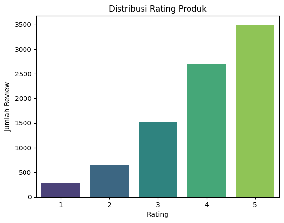

# Laporan Proyek Machine Learning - Laila Rohmatul I'zzah

## Project Overview

Industri skincare di Indonesia mengalami pertumbuhan yang sangat pesat dalam beberapa tahun terakhir. Beragamnya produk dari berbagai merek membuat konsumen sering kali kesulitan menentukan pilihan yang tepat sesuai dengan jenis dan kondisi kulit mereka. Kesalahan dalam pemilihan produk tidak hanya menyebabkan hasil yang kurang efektif, tetapi juga berisiko menimbulkan efek samping seperti jerawat, iritasi, hingga kerusakan kulit dalam jangka panjang.

Salah satu penyebab utama masalah ini adalah minimnya pengetahuan konsumen mengenai kandungan bahan aktif dalam produk skincare. Banyak konsumen hanya mengandalkan rekomendasi dari influencer atau iklan, yang tidak selalu sesuai dengan kebutuhan pribadi mereka. Oleh karena itu, dibutuhkan sebuah solusi berupa sistem yang mampu memberikan rekomendasi produk secara otomatis, personal, dan relevan.

Solusi ini diwujudkan melalui pengembangan sistem rekomendasi cerdas berbasis data. Studi oleh Putri et al. (2024) menunjukkan bahwa sistem rekomendasi skincare dapat meningkatkan kepuasan pengguna secara signifikan, dengan tingkat presisi mencapai 0.776 dan skor CSAT sebesar 80% melalui pendekatan hybrid filtering [1].

Berangkat dari latar belakang tersebut, proyek ini bertujuan untuk membangun sistem rekomendasi produk skincare yang mampu membantu pengguna menemukan produk yang sesuai dengan preferensi mereka. Sistem akan dikembangkan dengan dua pendekatan utama, yaitu:

- Content-Based Filtering, yang merekomendasikan produk berdasarkan kemiripan fitur seperti kategori, harga, merek, dan nama produk.
- Collaborative Filtering, yang memanfaatkan data preferensi pengguna lain untuk menyarankan produk dengan pola kesukaan serupa.

Dengan adanya sistem ini, pengguna dapat lebih mudah menemukan produk yang sesuai tanpa harus mengalami proses trial-and-error yang berisiko bagi kesehatan kulit mereka.

**Referensi**

Yanisa Putri, K. S., I Made Agus Dwi Suarjaya, & Wayan Oger Vihikan. (2024). Sistem Rekomendasi Skincare Menggunakan Metode Content Based Filtering dan Collaborative Filtering. Decode: Jurnal Pendidikan Teknologi Informasi, 4(3), 764–774. https://doi.org/10.51454/decode.v4i3.601 

## Business Understanding

### Problem Statements

- **Konsumen kesulitan memilih produk skincare yang sesuai dengan kondisi dan kebutuhan kulit mereka.**
Banyaknya variasi produk dari berbagai merek menyebabkan pengguna seringkali kebingungan dalam menentukan produk yang tepat. Pemilihan yang keliru tidak hanya tidak efektif tetapi juga dapat menimbulkan masalah kulit seperti iritasi atau jerawat.
- **Konsumen cenderung memilih produk berdasarkan iklan atau rekomendasi influencer tanpa pemahaman kandungan dan kecocokan produk.**
Kurangnya literasi terhadap bahan aktif dalam produk skincare menyebabkan keputusan pembelian menjadi kurang informatif dan berisiko terhadap hasil yang tidak diharapkan.
- **Tidak adanya sistem yang memberikan rekomendasi produk skincare secara personal dan berbasis data.**
Saat ini, konsumen belum memiliki alat atau sistem yang mampu memberikan saran produk berdasarkan kebutuhan pribadi maupun pengalaman pengguna lain yang serupa.

### Goals
- **Membangun sistem rekomendasi yang mampu membantu pengguna menemukan produk skincare yang sesuai dengan preferensi dan kebutuhan kulit mereka.**
Sistem ini bertujuan meminimalisir kesalahan dalam memilih produk dan mengurangi ketergantungan pada rekomendasi yang tidak terverifikasi secara ilmiah.
- **Memberikan rekomendasi produk berdasarkan karakteristik produk dan preferensi pengguna melalui analisis konten.**
Sistem akan memanfaatkan informasi seperti kategori produk, merek, harga, dan fitur lainnya untuk menghasilkan saran produk yang mirip dengan produk yang disukai pengguna sebelumnya (content-based).
- **Mengintegrasikan pengalaman pengguna lain dalam sistem rekomendasi untuk meningkatkan relevansi hasil.**
Dengan memanfaatkan data rating dan ulasan pengguna lain, sistem dapat merekomendasikan produk berdasarkan pola perilaku pengguna yang memiliki preferensi serupa (collaborative filtering).

### Solution Approach
Untuk mencapai tujuan di atas, digunakan dua pendekatan utama:

#### 1. Content-Based Filtering
  - Sistem merekomendasikan produk yang memiliki fitur serupa dengan produk yang pernah disukai pengguna.
  - Pendekatan ini memanfaatkan informasi dari data seperti kategori, nama produk, harga, dan brand.
  - Implementasi dilakukan dengan mentransformasikan fitur-fitur produk menjadi vektor numerik menggunakan TfidfVectorizer, OneHotEncoder, dan StandardScaler, kemudian mengukur kemiripan antar produk dengan cosine similarity.

#### 2. Collaborative Filtering dengan SVD (Singular Value Decomposition)
  - Sistem memprediksi preferensi pengguna terhadap produk baru berdasarkan interaksi dari pengguna lain yang memiliki pola serupa.
  - Model ini mengurai matriks rating menjadi faktor-faktor laten pengguna dan item, kemudian mengalikan vektor-vektor ini untuk memprediksi rating produk yang belum pernah dilihat pengguna.
  - Algoritma ini diimplementasikan dengan library scikit-surprise, dan dipilih karena skalabilitas dan performanya yang baik pada dataset besar dan sparse.

## Data Understanding

### Ringkasan Dataset
Proyek ini menggunakan dua buah dataset utama yang berasal dari [Kagle Dataset Skincare Review](https://www.kaggle.com/datasets/hafidahmusthaanah/skincare-review), yang dikompilasi oleh Hafidah Mustha’anah. Dataset ini diambil dari situs Female Daily pada tanggal 18 September 2020, dengan konten ulasan ditulis dalam Bahasa Indonesia oleh konsumen lokal Indonesia. Produk-produk dalam dataset ini meliputi brand populer yang mencerminkan dinamika pasar skincare di Indonesia, di antaranya:

| Nama Brand             | Nama Brand                    | Nama Brand                     |
|-------------------------|-----------------------------|-----------------------------|
| AVOSKIN                 | Kiehl's                     | Pond's                      |
| Acnes                   | Kiss Me                     | Probio C                    |
| Avene                   | Klairs                      | Pulchra                     |
| Azarine Cosmetics       | Kleveru Organics            | Purbasari                   |
| Banila Co               | Kracie                      | Pyunkang Yul                |
| Benton                  | Krave Beauty                | QIANSOTO                    |
| Bioaqua                 | L'Oreal Paris               | RDL                         |
| Bioderma                | L.A. Girl                   | Raiku Beauty                |
| Biokos                  | LT PRO                      | RapidLash                   |
| Biore                   | LUSH                        | Ristra                      |
| Botanicabeauty.id       | La Mer                      | Roro Mendut                 |
| Breylee                 | La Roche-Posay              | Rose All Day Cosmetics      |
| Brunbrun Paris          | La Tulipe                   | SADA by Cathy Sharon        |
| Caladine                | Lacoco                      | SHILLS                      |
| Celebon                 | Laneige                     | SK-II                       |
| CeraVe                  | Larissa                     | Safi                        |
| Cetaphil                | Lionesse Gem Skin Care      | Sariayu                     |
| Charis                  | Luxcrime                    | Saripohatji                 |
| Citra                   | MY SCHEMING                 | Secret Key                  |
| Clean And Clear         | Madame Gie                  | Senka                       |
...

Dataset terbagi menjadi dua yang berisi informasi dan review produk skincare.

**Dataset 1** — Ulasan Produk Skincare (review_produk.csv)
Dataset ini berisi 8.646 baris data yang merekam interaksi pengguna terhadap berbagai produk skincare, termasuk ulasan, rating, serta kondisi kulit pengguna.

**Dataset 2** — Informasi Produk Skincare (info_produk.csv)
Dataset ini berisi 861 baris data yang mencakup informasi inti mengenai produk skincare yang tersedia, seperti nama, kategori, harga, dan rating rata-rata.

### Variabel pada Dataset
`review_produk.csv`

Dataset ini mencatat interaksi pengguna terhadap produk skincare. Terdiri dari 7 kolom:
1. Product : Nama produk yang diulas oleh pengguna. 
2. UserName : Nama atau ID pengguna yang memberikan ulasan.
3. SkinCond_Age : Kondisi kulit pengguna beserta usia, dalam format gabungan seperti “Oily,23” atau “Dry, 30”.
4. Recommend : Indikator apakah pengguna merekomendasikan produk tersebut (biasanya berisi “Yes” atau “No”).
5. PostDate : Tanggal ulasan diposting.
6. Review : Ulasan teks atau opini pengguna terhadap produk yang digunakan.
7. Rating : Skor penilaian terhadap produk, dalam skala 1–5.

`info_produk.csv`

Dataset ini mencatat metadata produk skincare. Terdiri dari 6 kolom:
1. Category : Kategori produk skincare, seperti Cleanser, Serum, Moisturizer, dll.
2. Merk : Nama merek atau brand dari produk (misalnya Wardah, Emina, Scarlett, dll).
3. Product : Nama lengkap produk skincare.
4. Price : Harga produk dalam satuan Rupiah.
5. OverallRating : Rata-rata rating produk dari seluruh pengguna.
6. Reviewer : Jumlah reviewer yang pernah memberikan ulasan terhadap produk tersebut.

### Exploratory Data Analysis
#### Informasi Dataset

1. Pada data `info_produk.csv`, terdapat 4 kolom dengan tipe object, yaitu: Category, Merk, Product, dan Price. Kolom ini merupakan categorical features (fitur non-numerik). Terdapat 2 kolom numerik dengan tipe data float64 yaitu: OverallRating dan Reviewer. Ini merupakan fitur numerik.
2. Pada data `review_produk.csv`, terdapat 6 kolom dengan tipe object, yaitu: Product, UserName, SkinCond_Age, Recommend, PostDate, Review, dan Rating. Kolom ini merupakan categorical features (fitur non-numerik). Terdapat 1 kolom numerik dengan tipe data float64 yaitu: Rating. Ini merupakan fitur numerik.

#### Deteksi Missing Values

1. Pada data `info_produk.csv`, terdapat perbedaan jumlah data pada kolom *Price* dan *Reviewer* yang mengindikasikan adanya (missing values) pada data ini.
2. Pada data `review_produk.csv`, terdapat perbedaan jumlah data pada kolom SkinCond_Age dan Recommend yang mengindikasikan adanya missing values pada kedua kolom tersebut.

#### Deteksi Data Duplikat

1. Pada data `info_produk.csv`, tidak ditemukan data duplikat.
2. Pada data `review_produk.csv`, terdapat sebanyak 191 data duplikat.

### Visualisasi Data

Berdasarkan histogram di atas, dapat dilihat bahwa rating 5 memiliki jumlah review terbanyak yaitu sejumlah 3500 review. Sedangkan rating 1 memiliki jumlah review paling sedikit sekitar 300 review. Hal ini menunjukkan bahwa rata-rata produk yang dianalisis memiliki rating yang bagus dari pengguna.

Histogram di atas berisi 10 brand dengan jumlah item produk yang paling banyak. Produk terbanyak adalah Wardah dengan jumlah lebih dari 40 item, kemudian disusul oleh The Body Shop dan Garnier yang menduduki posisi 3 besar produk terbanyak. 

Histogram di atas menunjukkan 10 jenis produk dengan jumlah review terbanyak. Face Mist menduduki peringkat pertama dengan jumlah mencapai 70 review. Dilanjutkan dengan Milk Cleanser dan Brightening Night Cream dengan jumlah review yang sama yaitu 60 review.

## Data Preparation
### 1. Mengatasi Missing Values

Berikut beberapa tahapan yang dilakukan untuk mengatasi nilai kosong (missing values) dalam dataset:

#### Missing Values pada data `info_produk.csv`

##### a. Penghapusan Baris dengan Nilai Kosong
Sebelumnya telah diperiksa jumlah missing values pada tahap Data Understanding. Setelah itu, semua baris yang mengandung nilai kosong pada kolom manapun dihapus menggunakan fungsi `dropna()`. Langkah ini diambil karena jumlah nilai kosong relatif sedikit dan tidak tersebar luas, sehingga tidak berdampak besar terhadap representasi keseluruhan data. Selain itu, penghapusan lebih aman dibandingkan imputasi karena tidak menambahkan asumsi yang bisa menyebabkan bias.

##### b. Pembuatan Salinan Data Bersih
Setelah baris-baris dengan nilai kosong dihapus, hasilnya disalin ke dalam variabel baru bernama `info_produk_cleaned`. Salinan ini dibuat secara eksplisit untuk memastikan bahwa data asli tidak berubah, dan seluruh proses preprocessing serta modeling dilakukan pada data yang sudah bersih.

##### c. Pemeriksaan Ulang Nilai Kosong
Langkah terakhir adalah melakukan pengecekan ulang terhadap dataset `info_produk_cleaned` untuk memastikan bahwa tidak ada lagi nilai kosong yang tersisa. Hal ini penting untuk mencegah error pada tahap transformasi data atau pelatihan model di tahap berikutnya.

#### Missing Values pada data `review_produk.csv`

##### a. Imputasi Nilai Hilang pada Kolom SkinCond_Age
Kolom SkinCond_Age merupakan fitur kategorikal yang berisi informasi gabungan jenis kulit dan usia reviewer. Beberapa nilai dalam kolom ini hilang (missing). Untuk mengatasi hal tersebut, dilakukan imputasi menggunakan modus (nilai yang paling sering muncul). Imputasi modus dipilih karena kolom ini bertipe kategorikal dan modus mampu mempertahankan representasi data dominan. Jika tidak terdapat missing value, maka proses ini dilewati.

##### b. Pembuatan Fitur Biner dari Kolom Recommend
Kolom Recommend berisi teks yang menyatakan apakah pengguna merekomendasikan produk atau tidak. Karena kolom ini tidak berbentuk numerik atau kategorikal eksplisit, maka dilakukan feature engineering untuk mengubahnya menjadi dua fitur biner:

- Recommends: bernilai True jika teks dalam kolom Recommend mengandung pola “recommends this product!”.
- Not_Recommends_Info: bernilai True jika teks menyatakan ketidakrekomendasian (pola negatif), meskipun dalam kode ini belum didefinisikan secara eksplisit (kosong/null).

Langkah ini bertujuan mengubah informasi teks menjadi bentuk fitur terstruktur (biner) yang bisa diproses lebih lanjut dalam analisis atau pemodelan machine learning.

##### c. Validasi dan Pemeriksaan Konflik Data
Setelah kolom biner terbentuk, dilakukan pemeriksaan untuk:

- Menghitung jumlah review yang merekomendasikan dan tidak merekomendasikan.
- Mengidentifikasi potensi konflik, yaitu baris yang ditandai sebagai merekomendasikan dan tidak merekomendasikan sekaligus (yang seharusnya tidak terjadi).
- Menghitung jumlah review tanpa informasi rekomendasi yang jelas (baik karena teks tidak cocok, atau karena kolom Recommend kosong).

##### d. Pemeriksaan Nilai Hilang Setelah Pembersihan
Langkah terakhir adalah mengecek ulang nilai kosong pada seluruh kolom, memastikan bahwa kolom `SkinCond_Age` sudah tidak memiliki missing value, dan bahwa kolom baru (Recommends, Not_Recommends_Info) telah terisi dengan benar.

### 2. Mengatasi Data Duplikat
#### a. Penghapusan Data Duplikat
Setelah diketahui jumlah data duplikat pada tahap Data Understanding, selanjutnya akan dilakukan penghapusan menggunakan metode `drop_duplicates()`, dengan parameter `keep='first'`. Artinya, jika terdapat baris-baris yang identik, hanya baris pertama yang dipertahankan, sementara sisanya dihapus. Pendekatan ini umum digunakan karena mengasumsikan bahwa duplikat adalah hasil dari input data ganda, dan satu salinan dianggap cukup untuk analisis.

Hasil penghapusan duplikat disimpan ke dalam variabel baru `review_produk_cleaned_duplicates` untuk menjaga data asli tetap utuh dan agar proses selanjutnya dilakukan pada data yang sudah bersih.

#### b. Validasi Penghapusan dan Penerapan Data Bersih
Setelah penghapusan, dilakukan validasi ulang untuk memastikan bahwa tidak ada lagi baris yang terdeteksi sebagai duplikat. Data yang sudah bersih kemudian digunakan untuk langkah-langkah preprocessing dan modeling selanjutnya, dengan disimpan dalam variabel `kosmetik`. Langkah ini penting untuk menjaga kualitas dan integritas data, serta menghindari bias atau pengaruh berlebihan dari data yang berulang dalam sistem rekomendasi yang akan dibangun.

### 3. Standarisasi Fitur Numerik (Price)
Kolom Price pada dataset awal disimpan dalam format string dengan simbol mata uang (misalnya “Rp. 91.000”). Untuk dapat digunakan dalam analisis numerik dan pemodelan, kolom ini perlu dibersihkan dan dikonversi menjadi tipe data numerik (float). Langkah-langkah yang dilakukan meliputi:

- Menghapus teks “Rp.” dan spasi menggunakan ekspresi reguler.
- Menghapus titik pemisah ribuan agar tidak mengganggu konversi angka.
- Mengganti koma (,) menjadi titik (.) jika ada, untuk konsistensi format desimal.
- Mengonversi hasil akhir menjadi tipe float agar dapat diolah dalam transformasi numerik selanjutnya (misalnya scaling atau agregasi statistik).

Langkah ini penting karena harga merupakan fitur numerik penting dalam sistem rekomendasi, dan kesalahan format dapat menyebabkan error atau hasil model yang tidak valid.

### 4. Transformasi dan Encoding Fitur (Content Based Filtering)
Berikut tahapan yang dilakukan dalam menyiapkan data untuk modeling, yaitu dengan mengubah data mentah menjadi bentuk vektor numerik yang dapat diproses oleh algoritma machine learning:

#### a. Identifikasi dan Pemisahan Tipe Fitur
Fitur-fitur dalam dataset dikelompokkan berdasarkan jenis datanya:

- Fitur numerik: Price, OverallRating, dan Reviewer — mewakili informasi kuantitatif produk.
- Fitur kategorikal: Category dan Merk — merepresentasikan jenis produk dan merek.
- Fitur teks: Product — yaitu nama produk, yang mengandung informasi penting secara semantik.

Langkah ini penting untuk menentukan transformasi yang sesuai pada masing-masing jenis data.

#### b. Pembuatan Pipeline Preprocessing
Dibuat pipeline preprocessing menggunakan `ColumnTransformer` untuk menerapkan transformasi berbeda sesuai tipe data:

- StandardScaler pada fitur numerik: untuk menormalkan skala data agar memiliki mean 0 dan standar deviasi 1. Hal ini penting agar fitur numerik tidak mendominasi perhitungan jarak dalam algoritma seperti cosine similarity.
- OneHotEncoder pada fitur kategorikal: mengubah kategori seperti nama merek atau jenis produk menjadi format biner (0/1) agar dapat diproses secara matematis.
- TfidfVectorizer pada fitur teks Product: mengubah teks menjadi representasi vektor menggunakan TF-IDF (Term Frequency-Inverse Document Frequency), yang mencerminkan pentingnya kata dalam konteks keseluruhan produk.

Pipeline ini menjamin proses preprocessing dilakukan secara terstruktur, efisien, dan bisa digunakan kembali di tahap inference nanti.

#### c. Transformasi Data (Fit Transform)
Setelah pipeline dibuat, data asli yang sudah dibersihkan `kosmetik_info_cleaned` diproses menggunakan `fit_transform()`. Hasil akhirnya adalah matriks vektor yang mewakili setiap produk skincare dalam bentuk numerik dan dapat digunakan untuk modeling berbasis jarak, seperti cosine similarity.

### 5.  Persiapan Data untuk Collaborative Filtering dengan Surprise
Berikut adalah tahapan persiapan data sebelum membangun model collaborative filtering menggunakan library Surprise:

#### a. Pemilihan Data dan Validasi Struktur
Langkah pertama adalah menyalin data review produk yang sudah dibersihkan dari variabel kosmetik ke `review_data_for_cf`. Setelah itu, dilakukan validasi bahwa tiga kolom penting tersedia:

- Review → mewakili ID pengguna
- Product → mewakili ID item atau produk
- Rating → nilai penilaian yang diberikan oleh pengguna terhadap produk

Jika salah satu kolom ini tidak tersedia, proses akan dihentikan karena struktur data tidak memenuhi syarat untuk digunakan dalam sistem rekomendasi berbasis collaborative filtering. Selain itu, dicetak informasi dasar mengenai jumlah baris data, jumlah pengguna unik, dan jumlah produk unik untuk memberikan gambaran skala dataset yang akan digunakan.

#### b. Transformasi Format Data ke Library Surprise
Setelah struktur data valid, dilakukan proses transformasi data agar dapat digunakan oleh library Surprise, yang secara khusus dirancang untuk membangun sistem rekomendasi. Langkah-langkahnya meliputi:

- Penentuan skala rating: dengan mengambil nilai minimum dan maksimum dari kolom Rating untuk mendefinisikan rentang skor yang valid. Ini diperlukan agar `Surprise.Reader` bisa membaca data dengan benar.
- Konversi ke objek Surprise Dataset: data yang berisi kolom Review, Product, dan Rating diubah menjadi format dataset internal milik Surprise menggunakan `Dataset.load_from_df(...)`.

Hasil dari langkah ini adalah data yang siap untuk digunakan dalam proses pelatihan model collaborative filtering menggunakan algoritma SVD.

## Modeling
Pada sistem rekomendasi Skincare ini akan digunakan dua model yang berbeda, yaitu Content Based Filtering dan Collaborative Filtering. 

### 1. Kelebihan dan Kekurangan Algoritma
#### a. Content Based Filtering

Content-Based Filtering (CBF) merupakan sistem rekomendasi yang bergantung pada fitur-fitur dari item itu sendiri dan profil preferensi pengguna.

##### **Keuntungan Content-Based Filtering:**

1. Tidak memerlukan data pengguna lain: Rekomendasi untuk pengguna baru dapat dibuat bahkan jika belum ada data interaksi dari pengguna lain ("cold-start problem" untuk pengguna).
2. Dapat merekomendasikan item baru: Item baru dapat direkomendasikan segera setelah fitur-fiturnya tersedia, bahkan jika belum ada interaksi pengguna dengan item tersebut ("cold-start problem" untuk item).
3. Rekomendasi dapat dijelaskan: Karena berdasarkan fitur item, seringkali lebih mudah menjelaskan mengapa suatu item direkomendasikan (misalnya, "Anda direkomendasikan serum ini karena Anda menyukai serum sebelumnya dan keduanya mengandung Vitamin C").

##### **Kekurangan Content-Based Filtering:**

1. Ketergantungan pada kualitas representasi item: Kualitas rekomendasi sangat bergantung pada seberapa baik fitur-fitur item menangkap karakteristik pentingnya. Jika fitur item terbatas (seperti hanya nama produk dan kategori), rekomendasinya mungkin kurang relevan.
2. Tidak merekomendasikan item di luar "gelembung" preferensi pengguna: Sistem CBF cenderung merekomendasikan item yang sangat mirip dengan apa yang sudah disukai pengguna, sehingga sulit untuk menemukan item baru yang mungkin disukai tetapi sangat berbeda dari yang sebelumnya. Ini disebut masalah "over-specialization".
3. Membutuhkan data fitur item yang kaya: Jika hanya sedikit informasi tentang item yang tersedia, sulit untuk membuat representasi item yang meaningful.

#### b. Collaborative Filtering
##### Keuntungan Collaborative Filtering
1. Tidak membutuhkan fitur produk: Collaborative filtering hanya mengandalkan interaksi pengguna (misalnya: rating, klik, review), sehingga tetap bekerja meskipun data produk tidak lengkap. Cocok jika produk tidak punya deskripsi detail atau teks panjang seperti ingredients.
2. Dapat menemukan hubungan yang tidak eksplisit: Misalnya, "dua produk berbeda jenis tapi sering disukai oleh pengguna yang sama → akan direkomendasikan meskipun kontennya beda". Menemukan pola berbasis perilaku pengguna, bukan sekadar kesamaan konten.
3. Personalized: Rekomendasi disesuaikan dengan preferensi spesifik pengguna, bukan hanya produk yang mirip secara umum.
   
##### Kekurangan Collaborative Filtering
1. Cold Start Problem: Jika ada produk baru atau pengguna baru tanpa interaksi historis, sistem kesulitan memberikan rekomendasi. Ini sangat umum dan salah satu kelemahan utama.
2. Data Sparsity: Jika jumlah pengguna dan item sangat banyak, tapi sedikit interaksi (rating) → matriks interaksi jadi sangat jarang (sparse), dan model sulit belajar dengan baik.
3. Komputasi Berat: Beberapa metode (misalnya matrix factorization) memerlukan waktu pelatihan dan memori yang cukup besar, terutama pada dataset skala besar.
4. Rentan terhadap manipulasi: Pengguna bisa memberikan rating palsu untuk memengaruhi sistem (misalnya spam review).

### 2. Cara Kerja Algoritma
#### a. Content Based Filtering

1. Membuat Representasi Item (Fitur Item): Ini adalah langkah pertama dan paling penting.  Perlu didefinisikan apa saja "konten" atau fitur yang menggambarkan setiap produk skincare. Berdasarkan data info_produk.csv Anda, fitur yang relevan meliputi:

    - Category: (e.g., Serum, Moisturizer, Cleanser)
    - Merk: (e.g., Wardah, Emina, Scarlett)
    - Product Name: Nama produk itu sendiri (kata-kata dalam nama bisa menjadi fitur).
    - Ingredients (Jika ada): Daftar bahan-bahan dalam produk adalah fitur konten yang sangat kuat (sayangnya, ini tidak ada di info_produk.csv yang Anda gunakan, tetapi idealnya ini akan disertakan).
    - Price: Harga (meskipun numerik, ini adalah atribut item).
    - OverallRating: Rating rata-rata (juga atribut item).
    - Reviewer: Jumlah reviewer (atribut item).

Untuk menggunakan fitur-fitur ini dalam model, perlu mengubahnya menjadi format numerik yang sudah dilakukan pada tahap Data Preparation.

2. Membuat Profil Pengguna

  Ada beberapa cara untuk membuat profil preferensi pengguna:

  - Berdasarkan Item yang Disukai: Profil pengguna dibuat dengan menggabungkan (misalnya, merata-ratakan) vektor fitur dari semua item yang disukai pengguna tersebut (berdasarkan rating tinggi, pembelian, dll.).
  - Berdasarkan Interaksi: Profil bisa berupa representasi item terakhir yang diinteraksi, atau kombinasi dari item yang paling sering atau paling lama diinteraksi.
  - Explicit Feedback: Menggunakan rating eksplisit atau label suka/tidak suka dari pengguna.
  - Implicit Feedback: Menggunakan tindakan pengguna seperti melihat produk, mengklik, menambah ke keranjang, dll.

  Dalam sistem rekomendasi ini, pendekatan yang digunakan sedikit berbeda dan lebih mirip dengan mencari "item serupa" secara langsung berdasarkan fitur item, tanpa membangun profil pengguna eksplisit terlebih dahulu. Ketika memanggil `recommend_products("Nama Produk")`, fungsi tersebut:

    - Mengambil vektor fitur dari produk yang menjadi input (kosmetik_processed[idx]).
    - Menghitung kemiripan (menggunakan Cosine Similarity) antara vektor fitur produk input tersebut dan vektor fitur dari semua produk lain dalam dataset (cosine_similarity(kosmetik_processed[idx], kosmetik_processed)).
    - Mengurutkan produk berdasarkan skor kemiripan dan merekomendasikan produk dengan skor kemiripan tertinggi (selain produk itu sendiri).
    - Menghasilkan Rekomendasi: Setelah memiliki representasi item dan profil pengguna, sistem dapat merekomendasikan item baru kepada pengguna:
    - Bandingkan profil pengguna dengan vektor fitur semua item yang belum pernah diinteraksi pengguna.

3. Rekomendasikan item yang paling "mirip" dengan profil pengguna.

  Dalam sistem ini, rekomendasi dihasilkan dengan menemukan item lain yang memiliki vektor fitur yang sangat mirip dengan item yang menjadi input pengguna. Ini bisa dianggap sebagai sub-tipe CBF yang fokus pada "item-to-item similarity" berdasarkan konten/fitur item. Ini berguna ketika pengguna memilih satu item dan ingin menemukan item lain yang serupa dengannya.

#### 2. Collaborative Filtering
**Rubrik/Kriteria Tambahan (Opsional)**: 
- Menyajikan dua solusi rekomendasi dengan algoritma yang berbeda.
- Menjelaskan kelebihan dan kekurangan dari solusi/pendekatan yang dipilih.

## Evaluation
Pada bagian ini Anda perlu menyebutkan metrik evaluasi yang digunakan. Kemudian, jelaskan hasil proyek berdasarkan metrik evaluasi tersebut.

Ingatlah, metrik evaluasi yang digunakan harus sesuai dengan konteks data, problem statement, dan solusi yang diinginkan.

**Rubrik/Kriteria Tambahan (Opsional)**: 
- Menjelaskan formula metrik dan bagaimana metrik tersebut bekerja.

**---Ini adalah bagian akhir laporan---**

_Catatan:_
- _Anda dapat menambahkan gambar, kode, atau tabel ke dalam laporan jika diperlukan. Temukan caranya pada contoh dokumen markdown di situs editor [Dillinger](https://dillinger.io/), [Github Guides: Mastering markdown](https://guides.github.com/features/mastering-markdown/), atau sumber lain di internet. Semangat!_
- Jika terdapat penjelasan yang harus menyertakan code snippet, tuliskan dengan sewajarnya. Tidak perlu menuliskan keseluruhan kode project, cukup bagian yang ingin dijelaskan saja.
